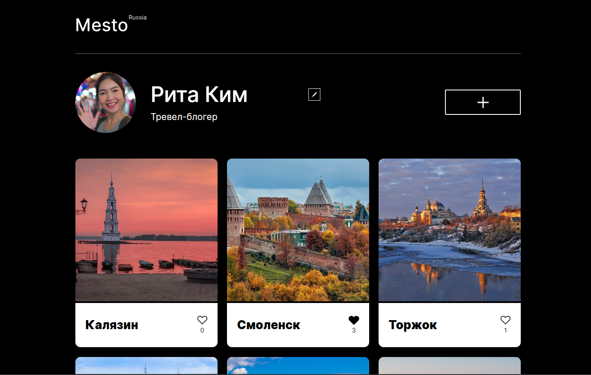

# Проект Mesto

Место для наших воспоминаний

## Описание
Интерактивная страница, куда можно добавлять фотографии, удалять их и ставить лайки.

## Live просмотр

[Перейти на страницу демо](https://dalilam25.github.io/mesto/)

## Технологический стек
- JavaScript
- Webpack
  
## Что можно улучшить...
Приложение находится в полностью рабочем состоянии, все задуманные функции реализованы. Тем не менее планирую добавить/изменить несколько вещей в ближайшее время.

- [ ] Оптимизация загрузки картинок
- [ ] Функционал добавления описания под фото
- [ ] Возможность просмотреть только свои фото (фильтрация)
